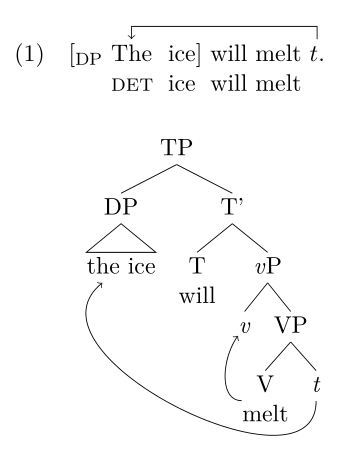

# LaTeX source files

LaTeX sources for articles on [my website](https://cjquines.com/).

If you want to compile these from source, or otherwise use my style file:

- Put cjquines.sty somewhere where LaTeX can see it. The same folder as the .tex file will work, but you can also put it somewhere [more permanent](https://tex.stackexchange.com/q/1137).

- You might need to install some LaTeX packages. The ones that you might not have installed by default are asymptote, fontawesome5, and relsize.

- If you want to compile diagrams, you'll need [Asymptote](https://asymptote.sourceforge.io/). Then cse5.asy, and olympiad.asy in the same folder as the .tex file, or somewhere [more permanent](https://asymptote.sourceforge.io/doc/Search-paths.html).

Some notes on cjquines.sty:

- You almost always want to use it with [KOMA-script](http://mirrors.ibiblio.org/CTAN/macros/latex/contrib/koma-script/doc/scrguien.pdf), with the `scrartcl`, `scrbook`, and `scrreprt` document classes.

- By default, it will change the header, page, title, and theorem styling, define some shortcuts for writing math, and include an Asymptote header.

- `wide` and `thin` control page size; the former has wider margins than usual and the latter has thinner margins than usual.

- `alttitle` gives a left-aligned title with a line separating it from the body.

- `boxthm` adds the `exboxed`, `exrboxed`, `probboxed`, and `thmboxed` environments, for putting examples, exercises, problems, and theorems in boxes.

- `parskip` makes the document spaced with spaces after paragraphs rather than paragraph indents.

- `noimport` removes imported packages and some of their dependencies.

- `nodefault` removes the header, page, title, and theorem styling.

- `noextlink` hides the external link icon for external links. This is the only place fontawesome5 and relsize are used, so you can use this option if these packages aren't available.

- `pset` and `oly` include specific styling for my homework solutions and olympiad papers.

- `linguistics` tightens the spacing of trees made by `forest`, and includes helpful macros:

```latex
\begin{exe}
\ex \gll
[\lb{DP} \name{The} ice] will melt \name[t]{$t$.}\\
{} \sc{det} ice will melt {}\\
\move{t}{The}
\end{exe}

\begin{forest}
[TP
  [DP
    [the ice,roof,name=t]
  ]
  [T'
    [T\\will]
    [\vp
      [\vv,name=tt]
      [VP
        [V\\melt,name=ss]
        [\textit{t},name=s]
      ]
    ]
  ]
]
\move{s}{S}{t}{SW}
\move{ss}{W}{tt}{SW}
\end{forest}
```



<!-- TODO: talk about tsqx, and clean up tsqx while we're at it -->
